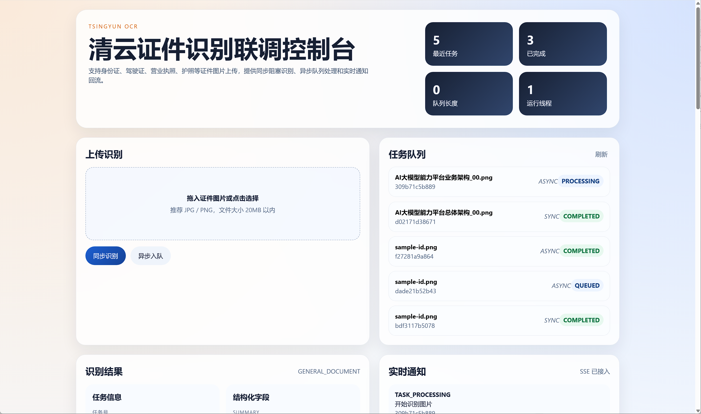

# 清云证件识别联调控制台

一个基于 PaddleOCR 能力的前后端联调示例，面向身份证、驾驶证、营业执照、护照等证件识别场景，提供同步阻塞识别、异步队列处理、任务查询和 SSE 实时通知。

## 项目截图



## 功能特性

- Spring Boot 3 + JDK 17 目标版本后端
- MyBatis-Plus + MySQL 数据持久化
- Vue 3 + Vite 前端控制台
- PaddleOCR Java 集成，支持常见证件图像 OCR
- 同步识别接口：上传后直接返回识别结果
- 异步识别接口：上传入队、后台消费、任务状态可查询
- SSE 实时通知：前端可感知任务开始、完成、失败事件
- 基础结构化字段提取：身份证、驾驶证、营业执照、护照

## 目录结构

```text
backend/   Spring Boot 后端
frontend/  Vue 前端
Dockerfile 单镜像构建文件
```

## 本地启动

### 1. 启动后端

数据库默认配置见 [backend/src/main/resources/application.yml](backend/src/main/resources/application.yml)。

编译打包：

```powershell
& 'D:\3-env\apache-maven-3.6.3\bin\mvn.cmd' package '-Dmaven.repo.local=D:\devTools\qyztRepository' -DskipTests
```

启动：

```powershell
java -jar .\backend\target\paddleocr-demo-0.0.1-SNAPSHOT.jar
```

默认端口：`18080`

### 2. 启动前端

```powershell
cd frontend
& 'C:\Program Files\nodejs\npm.cmd' install
& 'C:\Program Files\nodejs\npm.cmd' run dev
```

默认访问地址：`http://127.0.0.1:5173`

前端已通过 Vite 代理 `/api` 到 `http://127.0.0.1:18080`。

## 后端接口

- `POST /api/ocr/sync` 同步识别
- `POST /api/ocr/async` 异步识别
- `GET /api/ocr/tasks` 最近任务列表
- `GET /api/ocr/tasks/{taskNo}` 任务详情
- `GET /api/ocr/queue` 队列状态
- `GET /api/ocr/notifications` 通知列表
- `GET /api/ocr/notifications/stream` SSE 通知流

## Docker 运行

镜像：`harbor.tsingyun.net/platform/ai-ocr-demo:1.0`

示例启动命令：

```bash
docker run -d \
  --name ai-ocr-demo \
  --restart always \
  -p 8083:8083 \
  -e SERVER_PORT=8083 \
  -e SPRING_DATASOURCE_URL='jdbc:mysql://172.24.0.47:3306/tsingyun_platform_daas?useUnicode=true&characterEncoding=UTF-8&serverTimezone=Asia/Shanghai&allowPublicKeyRetrieval=true&useSSL=false' \
  -e SPRING_DATASOURCE_USERNAME='root' \
  -e SPRING_DATASOURCE_PASSWORD='123456' \
  -v /data/ai-ocr-demo/uploads:/app/backend/uploads \
  harbor.tsingyun.net/platform/ai-ocr-demo:1.0
```

访问地址：`http://服务器IP:8083`

## 已验证

- 后端编译与打包成功
- 前端构建成功
- 同步上传识别可用
- 异步入队、后台消费、状态回写可用
- Docker 镜像已构建并推送 Harbor
